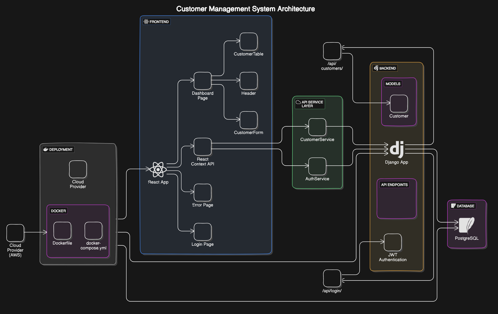

## Customer Management SPA

This repository contains the code for a Single Page Application (SPA) that allows users to securely log in, manage customer data, and handle various CRUD operations. The application is built with React, TypeScript, on the frontend and Django on the backend.

### **Detailed Instructions on How to Run the Application**

#### **Frontend**

1. **Prerequisites**:
   - Ensure you have [Node.js](https://nodejs.org/) (version 14 or higher) and [npm](https://www.npmjs.com/) installed.

2. **Clone the Repository**:
   ```bash
   git clone https://github.com/Vijaykumar933/Single_Page_Application.git
   cd customer-management-frontend
   ```

3. **Install Dependencies**:
   ```bash
   npm install
   ```

4. **Start the Development Server**:
   ```bash
   npm start
   ```
   The frontend will be available at [http://localhost:3000](http://localhost:3000).

#### **Backend**

1. **Prerequisites**:
   - Ensure you have [Python](https://www.python.org/) (version 3.8 or higher) and [pip](https://pip.pypa.io/en/stable/) installed.

2. **Clone the Repository**:
   ```bash
   git clone https://github.com/yourusername/customer-management-spa.git
   cd customer_management
   ```

3. **Create and Activate a Virtual Environment**:
   ```bash
   python -m venv venv
   source venv/bin/activate  # On Windows use: venv\Scripts\activate
   ```

4. **Install Dependencies**:
   ```bash
   pip install -r requirements.txt
   ```

5. **Run Database Migrations**:
   ```bash
   python manage.py migrate
   ```

6. **Start the Development Server**:
   ```bash
   python manage.py runserver
   ```
   The backend will be available at [http://localhost:8000](http://localhost:8000).

### **Explanation of the Design Patterns Used**

- **MVC Pattern (Model-View-Controller)**:
  - **Model**: The Django models represent the data structure and are used to interact with the database.
  - **View**: React components serve as views, rendering the UI based on state and props.
  - **Controller**: The API endpoints in Django act as controllers, handling HTTP requests and responses.

- **Component-Based Architecture**:
  - In the frontend, React components are used to create reusable UI elements. Each component handles its own state and behavior.

- **State Management**:
  - The React Context API is used for managing global state, such as user authentication.

- **Form Handling and Validation**:
  - React Hook Form is used to handle form state and validation in a declarative manner, ensuring data is validated and submitted correctly.

### **Diagram Illustrating the Application’s Architecture**



### **Assumptions and Decisions Made**

- **Security**:
  - JWT (JSON Web Tokens) are used for secure authentication and authorization. Tokens are stored in memory and managed via React Context.

- **Error Handling**:
  - Errors from API requests are handled gracefully with user-friendly error messages and redirections to an error page.

- **UI/UX**:
  - Material UI is used for a professional and responsive design. Components are styled to ensure a good user experience across different devices.

- **Database Choice**:
  - SQLite is used as the database for Django due to its robustness and support for queries.

- **Deployment**:
  - The application is containerized using Docker for ease of deployment and consistency across different environments.

